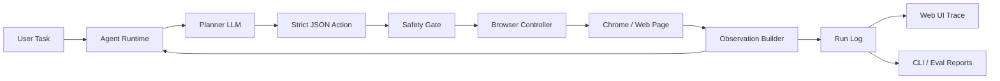

# ChromeClaw

**A transparent browser-control agent for Chrome.**

ChromeClaw is an OpenClaw-inspired local browser operator: it can chat with a user, plan a browser task, control Chrome through Playwright, observe webpages through text, accessibility summaries, ranked interactive targets, and screenshots, then explain the action trace in a polished web UI or terminal.

It is designed as a resume-grade frontier-lab artifact: real browser control, structured tool use, safety-gated autonomy, run logging, and reproducible browser-agent evals.

## Pitch

ChromeClaw = **an agentic browser operator that can see, plan, act, recover, and explain.**

The first working vertical slice:

```bash
chromeclaw run "Go to example.com and tell me the page title." --headless --provider mock
```

ChromeClaw launches Chrome/Chromium, navigates to `example.com`, observes the page title and visible text, finishes with the answer, and writes a JSONL trace.

## Architecture



## Repository

```text
apps/web          Next.js lab console with task panel, browser state, metrics, trace, and run viewer
apps/cli          Commander CLI: run, repl, eval
packages/agent    Agent loop, prompts, model providers, safety policy, JSONL logging
packages/browser  Playwright browser controller, observations, target resolution
packages/shared   Zod action schemas, shared types, truncation/ranking utilities
packages/evals    Browser-task benchmark harness and scoring
docs              Safety and eval notes
```

## Screenshots

Placeholders for project docs:

- `docs/screenshots/web-console.png` - ChromeClaw lab console
- `docs/screenshots/agent-trace.png` - flight-recorder action timeline
- `docs/screenshots/cli-run.png` - terminal run output

## Quickstart

```bash
pnpm install
pnpm build
pnpm dev
```

Open [http://localhost:3000](http://localhost:3000).

CLI smoke test:

```bash
pnpm build
node apps/cli/dist/index.js run "Go to example.com and tell me the page title." --headless --provider mock --max-steps 4
```

Run tests and evals:

```bash
pnpm typecheck
pnpm test
pnpm eval
```

## Configuration

Copy `.env.example` to `.env` and choose a provider.

```env
OPENAI_API_KEY=
OPENAI_BASE_URL=
CHROMECLAW_PROVIDER=openai
CHROMECLAW_MODEL=gpt-4.1-mini
CHROMECLAW_HEADLESS=false
CHROMECLAW_MAX_STEPS=20
```

Keyless smoke tests use:

```env
CHROMECLAW_PROVIDER=mock
```

Local OpenAI-compatible endpoints:

```env
OPENAI_BASE_URL=http://localhost:11434/v1
CHROMECLAW_PROVIDER=local
CHROMECLAW_MODEL=qwen2.5-coder:7b
```

## Example Tasks

- “Go to example.com and tell me the page title.”
- “Find the top 5 recent papers on browser agents and summarize them.”
- “Open Hacker News and find the highest-ranked AI story.”
- “Compare prices for a product across 3 sites without logging in.”
- “Extract the headings from this webpage.”
- “Find documentation for Playwright accessibility snapshots.”

## Safety Model

ChromeClaw has an explicit `SafetyPolicy` module. It blocks or requires confirmation before:

- Login, credentials, 2FA, or private data entry.
- Purchases, checkout, banking, trading, payments, or subscriptions.
- Sending emails/messages/posts/comments.
- Deleting, modifying, uploading, or downloading user data.
- Bypassing CAPTCHAs, paywalls, login walls, or security barriers.
- Sensitive browser, file, or local administrative pages.

The agent stores short `thoughtSummary` fields only. It does not expose hidden chain-of-thought.

## Evals

The eval harness includes 10 browser tasks with deterministic substring or validator checks. The default smoke subset currently passes in mock mode:

```text
successRate: 1.0
averageSteps: 2.33
tasks: example title, Playwright docs, Hacker News top page
report: .chromeclaw/eval-report.json
```

Run all evals:

```bash
pnpm --filter @chromeclaw/evals eval -- --all
```

## What Works

- Real Playwright browser launch/control.
- Headless or visible Chrome/Chromium operation.
- Persistent profile directory under `.chromeclaw/profile`.
- Structured Zod action schemas.
- Mock planner for keyless testing.
- OpenAI-compatible chat-completions planner.
- Anthropic provider placeholder behind the provider abstraction.
- Accessibility/text/interactive-target observations with truncation and ranking.
- Safety-gated action execution.
- JSONL run logs under `.chromeclaw/runs`.
- Next.js web console with trace, browser state, metrics, samples, and run history.
- CLI `run`, `repl`, and `eval`.
- Vitest coverage for schemas, safety, truncation/ranking, target helpers, and eval scoring.

## What Is Stubbed

- Anthropic-compatible provider is a placeholder.
- Web “Stop” aborts the client request; a durable server-side cancellation registry is future work.
- SQLite is not enabled by default; JSONL was chosen for zero native dependency friction.
- Experimental arbitrary JavaScript execution is intentionally not exposed.

## Roadmap

- Streaming step updates over SSE/WebSocket.
- Durable run cancellation and resume.
- SQLite storage adapter and richer run search.
- More robust role/name target scoring from full accessibility snapshots.
- Human confirmation UI for gated actions.
- Larger eval suite with fixtures, replay, and per-action error taxonomies.
- Optional CDP performance/network tracing.
- Browser preview streaming instead of post-step screenshots.

## Why This Matters

ChromeClaw demonstrates:

- Tool-using agent loops.
- Browser-grounded observation/action cycles.
- Structured LLM outputs.
- Safety-gated autonomy.
- Reproducible browser-agent evaluation.
- Production-grade TypeScript packaging.

Resume bullet:

> Built ChromeClaw, a TypeScript browser-control agent that uses structured LLM planning, Playwright/CDP browser actions, safety-gated execution, trace logging, and a browser-task eval harness to autonomously complete web tasks through Chrome.

## License

MIT
