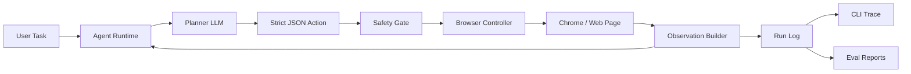

# ChromeClaw

**A transparent terminal-first browser-control agent for Chrome.**

ChromeClaw is a local browser operator built for the command line. It plans browser tasks, controls Chrome through Playwright, observes pages through visible text and accessibility summaries, records every step to JSONL, and makes the full agent trace easy to inspect from the terminal.

ChromeClaw = **an agentic browser operator that can see, plan, act, recover, and explain** from the terminal.

```bash
chromeclaw run "Go to example.com and tell me the page title." --headless --provider mock
```

ChromeClaw launches Chrome/Chromium, navigates to `example.com`, observes the page title and visible text, finishes with the answer, and writes a JSONL trace.

## Architecture



## Repository

```text
apps/cli          Commander-based terminal interface: run, repl, runs, show, eval
packages/agent    Agent loop, prompts, providers, safety policy, JSONL logging
packages/browser  Playwright browser controller, observations, target resolution
packages/shared   Zod action schemas, shared types, truncation and ranking utilities
packages/evals    Browser-task benchmark harness and scoring
docs              Safety and eval notes
```

## Quickstart

```bash
pnpm install
pnpm build
pnpm dev
```

`pnpm dev` opens the interactive terminal REPL.

Direct CLI examples:

```bash
node apps/cli/dist/index.js run "Go to example.com and tell me the page title." --headless --provider mock --max-steps 4
node apps/cli/dist/index.js runs
node apps/cli/dist/index.js show <run-id>
```

Run checks:

```bash
pnpm lint
pnpm typecheck
pnpm test
pnpm eval
```

## Configuration

Use `.env.example` for local setup:

```env
OPENAI_API_KEY=
OPENAI_BASE_URL=
HF_TOKEN=
HUGGINGFACE_API_KEY=
HF_BASE_URL=https://router.huggingface.co/v1
CHROMECLAW_PROVIDER=openai
CHROMECLAW_MODEL=gpt-4.1-mini
CHROMECLAW_HEADLESS=false
CHROMECLAW_MAX_STEPS=20
```

Keyless smoke tests:

```env
CHROMECLAW_PROVIDER=mock
```

Local OpenAI-compatible endpoints:

```env
OPENAI_BASE_URL=http://localhost:11434/v1
CHROMECLAW_PROVIDER=local
CHROMECLAW_MODEL=qwen2.5-coder:7b
```

Hugging Face Inference Providers:

```env
CHROMECLAW_PROVIDER=huggingface
HF_TOKEN=hf_xxx
CHROMECLAW_MODEL=Qwen/Qwen2.5-Coder-32B-Instruct
```

ChromeClaw uses Hugging Face's OpenAI-compatible chat completions API at `https://router.huggingface.co/v1` by default, following the official Hugging Face docs:
[Chat Completion](https://huggingface.co/docs/inference-providers/tasks/chat-completion)

## Terminal UX

- `chromeclaw run "<task>"` executes one task and prints the live flight recorder.
- `chromeclaw repl` keeps a terminal session open for repeated tasks.
- `chromeclaw runs` lists recent JSONL traces.
- `chromeclaw show <run-id>` prints a past run with step-by-step context.
- `chromeclaw eval` runs the benchmark harness.

## Example Tasks

- "Go to example.com and tell me the page title."
- "Find the top 5 recent papers on browser agents and summarize them."
- "Open Hacker News and find the highest-ranked AI story."
- "Compare prices for a product across 3 sites without logging in."
- "Extract the headings from this webpage."
- "Find documentation for Playwright accessibility snapshots."

## Safety Model

ChromeClaw has an explicit `SafetyPolicy` module. It blocks or requires confirmation before:

- Login, credentials, 2FA, or private data entry.
- Purchases, checkout, banking, trading, payments, or subscriptions.
- Sending emails, messages, posts, or comments.
- Deleting, modifying, uploading, or downloading user data.
- Bypassing CAPTCHAs, paywalls, login walls, or security barriers.
- Sensitive browser, file, or local administrative pages.

The agent stores short `thoughtSummary` fields only. It does not expose hidden chain-of-thought.

## Evals

ChromeClaw ships with a 10-task browser benchmark harness. The default smoke subset passes in mock mode and writes a report to `.chromeclaw/eval-report.json`.

Run all evals:

```bash
pnpm --filter @chromeclaw/evals eval -- --all
```

## What Works

- Real Playwright browser launch and control.
- Headless or visible Chrome/Chromium operation.
- Persistent profile directory under `.chromeclaw/profile`.
- Structured Zod action schemas and strict JSON planning.
- Mock planner for keyless testing.
- OpenAI-compatible chat-completions planner.
- Hugging Face Inference Providers support through the OpenAI-compatible router API.
- Accessibility, visible-text, and ranked-target observations.
- Safety-gated execution.
- JSONL run logs under `.chromeclaw/runs`.
- Terminal run viewer and trace inspector.
- CLI `run`, `repl`, `runs`, `show`, and `eval`.
- Vitest coverage for schemas, safety, truncation, target helpers, and eval scoring.

## What Is Stubbed

- Anthropic-compatible provider is still a placeholder.
- Human confirmation is surfaced as a blocked run rather than a full interactive approval workflow.
- SQLite is not enabled by default; JSONL keeps setup friction low.
- Experimental arbitrary JavaScript execution remains intentionally disabled.


## License

MIT
